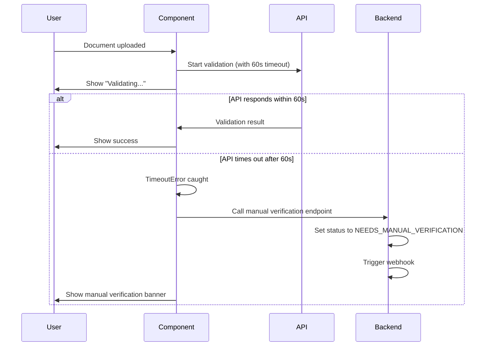

# Frontend Implementation Summary - Document Validation Timeout & Manual Verification

## Overview
Frontend implementation completed to prevent customers from getting stuck at document validation progress screens through timeout handling, progressive feedback, and manual verification fallback.

## Files Modified

### 1. TypeScript Component
**File**: `src/app/modules/auth/smart-enroll/smart-documents-review/smart-documents-review.component.ts`

**Changes**:
- ✅ Added RxJS `timeout` operator to all 5 validation API calls (60-second timeout)
- ✅ Implemented progressive feedback system with messages at 15s, 30s, 45s intervals
- ✅ Added timeout handler that calls manual verification endpoint
- ✅ Implemented retry mechanism for failed validations
- ✅ Added validation error tracking and display

**New Properties**:
```typescript
validationStartTimes: { [key: string]: number } = {};
validationMessages: { [key: string]: string } = {};
validationMessageIntervals: { [key: string]: ReturnType<typeof setTimeout>[] } = {};
validationErrors: { [key: string]: any } = {};
showManualVerificationBanner: boolean = false;
manualVerificationMessage: string = "";
retryingValidations: { [key: string]: boolean } = {};

private readonly VALIDATION_TIMEOUT = 60000; // 60 seconds
private readonly PROGRESS_MESSAGE_INTERVALS = [15000, 30000, 45000];
```

**New Methods**:
- `_handleValidationTimeout(validationType: string)` - Handles validation timeouts
- `_startProgressiveFeedback(validationType: string)` - Starts progressive messaging
- `_clearProgressiveFeedback(validationType: string)` - Clears message intervals
- `_getValidationDisplayName(validationType: string)` - Gets user-friendly validation names
- `retryValidation(validationType: string)` - Retries failed validations
- `hasValidationError(validationType: string)` - Checks if validation has errors

### 2. HTML Template
**File**: `src/app/modules/auth/smart-enroll/smart-documents-review/smart-documents-review.component.html`

**Changes**:
- ✅ Added manual verification banner at top of validation section
- ✅ Updated all validation item messages to display progressive feedback
- ✅ Added retry buttons for failed validations

**Manual Verification Banner**:
```html
<div class="w-full rounded-2xl p-4 flex items-start gap-3"
     *ngIf="showManualVerificationBanner"
     [style.background-color]="'#FEF3C7'"
     [style.border]="'1px solid #F59E0B'">
    <mat-icon class="text-yellow-600 flex-shrink-0">info</mat-icon>
    <div class="flex-grow">
        <h5 class="font-medium text-lg mb-1" style="color: #92400E">
            {{ t("smart_enroll.manual_verification_required") }}
        </h5>
        <p class="text-base" style="color: #78350F">
            {{ manualVerificationMessage }}
        </p>
    </div>
</div>
```

**Progressive Messages Example**:
```html
<p class="text-base">
    <span *ngIf="loading.nameValidation">
        {{ validationMessages['nameValidation'] || t("smart_enroll.documents.validating_names") }}
    </span>
    <!-- Success/Error states -->
</p>
```

**Retry Button Example**:
```html
<button *ngIf="hasValidationError('nameValidation') && !loading.nameValidation"
        (click)="retryValidation('nameValidation')"
        class="mt-2 px-3 py-1 text-sm rounded-md"
        [disabled]="retryingValidations['nameValidation']">
    <mat-icon>refresh</mat-icon>
    {{ t("smart_enroll.retry_validation") }}
</button>
```

### 3. KYC Service
**File**: `src/app/modules/auth/kyc.service.ts`

**New Method**:
```typescript
setDocumentValidationManualVerification(data: {
    _id: string;
    reason: string;
    timeoutType: string;
    elapsedTime: number;
}): Observable<any> {
    return this._httpWrapper.sendRequest(
        "put",
        `${this.baseUrl}/v2/document-validations/${data._id}/manual-verification`,
        data
    );
}
```

## Translation Keys Required

Add these keys to all language files in `src/assets/i18n/`:

### English (en)
```json
{
  "smart_enroll": {
    "validating": "Validating your information...",
    "still_validating": "Still validating, this may take a moment...",
    "almost_there": "Almost there, validating {{validation}}...",
    "taking_longer": "This is taking longer than usual...",
    "validation_timeout_manual_review": "Validation is taking too long. We've marked this for manual review. You'll be notified once the review is complete.",
    "name_mismatch_manual_review": "The names don't match perfectly. We've marked this for manual review. You can proceed with the registration and you'll be notified once the review is complete.",
    "manual_verification_required": "Manual Verification Required",
    "retry_validation": "Retry Validation",
    "name_verification": "name verification",
    "background_check": "background check",
    "document_background_check": "document background check",
    "face_comparison": "face comparison",
    "zero_knowledge_proof": "zero knowledge proof",
    "name_verification_mismatch_title": "Name Verification Issue Detected",
    "name_verification_mismatch_description": "The names on your document don't exactly match the official records. This could be due to formatting, middle names, or data entry differences.",
    "full_name_match": "Full Name Match",
    "first_name_match": "First Name Match",
    "last_name_match": "Last Name Match",
    "proceed_with_manual_verification_prompt": "You can proceed by requesting manual verification. An administrator will review your case and you'll be notified of the decision.",
    "proceed_with_manual_verification": "Proceed with Manual Verification"
  }
}
```

### Spanish (es)
```json
{
  "smart_enroll": {
    "validating": "Validando su información...",
    "still_validating": "Aún validando, esto puede tomar un momento...",
    "almost_there": "Casi listo, validando {{validation}}...",
    "taking_longer": "Esto está tomando más tiempo de lo habitual...",
    "validation_timeout_manual_review": "La validación está tomando demasiado tiempo. Lo hemos marcado para revisión manual. Se le notificará una vez que se complete la revisión.",
    "name_mismatch_manual_review": "Los nombres no coinciden perfectamente. Lo hemos marcado para revisión manual. Puede continuar con el registro y se le notificará una vez que se complete la revisión.",
    "manual_verification_required": "Verificación Manual Requerida",
    "retry_validation": "Reintentar Validación",
    "name_verification": "verificación de nombre",
    "background_check": "verificación de antecedentes",
    "document_background_check": "verificación de antecedentes del documento",
    "face_comparison": "comparación facial",
    "zero_knowledge_proof": "prueba de conocimiento cero",
    "name_verification_mismatch_title": "Problema de Verificación de Nombre Detectado",
    "name_verification_mismatch_description": "Los nombres en su documento no coinciden exactamente con los registros oficiales. Esto podría deberse a formato, segundos nombres o diferencias en la entrada de datos.",
    "full_name_match": "Coincidencia de Nombre Completo",
    "first_name_match": "Coincidencia de Primer Nombre",
    "last_name_match": "Coincidencia de Apellido",
    "proceed_with_manual_verification_prompt": "Puede continuar solicitando verificación manual. Un administrador revisará su caso y será notificado de la decisión.",
    "proceed_with_manual_verification": "Continuar con Verificación Manual"
  }
}
```

### Portuguese (pr)
```json
{
  "smart_enroll": {
    "validating": "Validando suas informações...",
    "still_validating": "Ainda validando, isso pode levar um momento...",
    "almost_there": "Quase lá, validando {{validation}}...",
    "taking_longer": "Isso está demorando mais do que o normal...",
    "validation_timeout_manual_review": "A validação está demorando muito. Marcamos para revisão manual. Você será notificado assim que a revisão for concluída.",
    "name_mismatch_manual_review": "Os nomes não correspondem perfeitamente. Marcamos para revisão manual. Você pode prosseguir com o registro e será notificado assim que a revisão for concluída.",
    "manual_verification_required": "Verificação Manual Necessária",
    "retry_validation": "Tentar Validação Novamente",
    "name_verification": "verificação de nome",
    "background_check": "verificação de antecedentes",
    "document_background_check": "verificação de antecedentes do documento",
    "face_comparison": "comparação facial",
    "zero_knowledge_proof": "prova de conhecimento zero",
    "name_verification_mismatch_title": "Problema de Verificação de Nome Detectado",
    "name_verification_mismatch_description": "Os nomes no seu documento não correspondem exatamente aos registros oficiais. Isso pode ser devido à formatação, nomes do meio ou diferenças na entrada de dados.",
    "full_name_match": "Correspondência de Nome Completo",
    "first_name_match": "Correspondência de Primeiro Nome",
    "last_name_match": "Correspondência de Sobrenome",
    "proceed_with_manual_verification_prompt": "Você pode continuar solicitando verificação manual. Um administrador revisará seu caso e você será notificado da decisão.",
    "proceed_with_manual_verification": "Continuar com Verificação Manual"
  }
}
```

### French (fr)
```json
{
  "smart_enroll": {
    "validating": "Validation de vos informations...",
    "still_validating": "Toujours en cours de validation, cela peut prendre un moment...",
    "almost_there": "Presque terminé, validation de {{validation}}...",
    "taking_longer": "Cela prend plus de temps que d'habitude...",
    "validation_timeout_manual_review": "La validation prend trop de temps. Nous l'avons marqué pour révision manuelle. Vous serez notifié une fois la révision terminée.",
    "name_mismatch_manual_review": "Les noms ne correspondent pas parfaitement. Nous l'avons marqué pour révision manuelle. Vous pouvez continuer l'inscription et vous serez notifié une fois la révision terminée.",
    "manual_verification_required": "Vérification Manuelle Requise",
    "retry_validation": "Réessayer la Validation",
    "name_verification": "vérification du nom",
    "background_check": "vérification des antécédents",
    "document_background_check": "vérification des antécédents du document",
    "face_comparison": "comparaison faciale",
    "zero_knowledge_proof": "preuve à divulgation nulle de connaissance",
    "name_verification_mismatch_title": "Problème de Vérification du Nom Détecté",
    "name_verification_mismatch_description": "Les noms sur votre document ne correspondent pas exactement aux dossiers officiels. Cela pourrait être dû au formatage, aux deuxièmes prénoms ou aux différences de saisie de données.",
    "full_name_match": "Correspondance du Nom Complet",
    "first_name_match": "Correspondance du Prénom",
    "last_name_match": "Correspondance du Nom de Famille",
    "proceed_with_manual_verification_prompt": "Vous pouvez continuer en demandant une vérification manuelle. Un administrateur examinera votre cas et vous serez notifié de la décision.",
    "proceed_with_manual_verification": "Continuer avec la Vérification Manuelle"
  }
}
```

## How It Works

### 1. Validation Flow with Timeout


### 2. Progressive Feedback Timeline
```
0s    → "Validating your information..."
15s   → "Still validating, this may take a moment..."
30s   → "Almost there, validating [specific check]..."
45s   → "This is taking longer than usual..."
60s+  → "Validation timed out. Marked for manual review."
```

### 3. Retry Mechanism
- Retry button appears when validation fails (not timeout)
- User can manually retry the specific failed validation
- Clears previous error and re-runs the validation
- Disables button while retrying to prevent double-clicks

## Testing Checklist

- [ ] Test validation timeout after 60 seconds
- [ ] Verify progressive messages appear at correct intervals (15s, 30s, 45s)
- [ ] Confirm manual verification banner shows on timeout
- [ ] Test manual verification endpoint is called on timeout
- [ ] Verify webhook notification is sent
- [ ] Test retry button functionality for failed validations
- [ ] Confirm translations display correctly in all languages
- [ ] Test with slow network conditions
- [ ] Verify all 5 validation types handle timeouts correctly:
  - [ ] Name verification
  - [ ] Criminal validation
  - [ ] Document criminal validation
  - [ ] Face comparison
  - [ ] Zero knowledge proof

## Deployment Steps

1. **Backend Deploy** (Already Complete):
   - New endpoint: `PUT /v2/document-validations/:id/manual-verification`
   - Model updates with timeout metadata fields
   - Webhook integration

2. **Frontend Deploy** (Ready):
   - Updated components and services
   - Add translation keys to all language files
   - Test in staging environment
   - Deploy to production

3. **Translation Files**:
   - Update `src/assets/i18n/en.json`
   - Update `src/assets/i18n/es.json`
   - Update `src/assets/i18n/pr.json`
   - Update `src/assets/i18n/fr.json`

4. **Verification**:
   - Monitor webhook deliveries
   - Check manual verification queue in admin panel
   - Review timeout frequency metrics
   - Gather user feedback

## Known Limitations

1. **Timeout applies to entire validation** - Individual steps within a validation don't have separate timeouts
2. **No partial retry** - Retry re-runs the entire validation, not individual failed steps
3. **Manual verification UI** - Requires admin to review cases (no automated retry after manual review)

## Future Enhancements

1. **Smart timeout adjustment** - Dynamic timeout based on historical validation times
2. **Partial validation results** - Save partial results even on timeout
3. **Auto-retry with backoff** - Automatically retry failed validations with exponential backoff
4. **Priority queue** - Prioritize time-sensitive manual verifications
5. **Real-time status updates** - WebSocket connection for live validation status

## Support

- Backend API: `PUT /v2/document-validations/:id/manual-verification`
- Webhook Event: `document_validation_manual_verification_required`
- Default Timeout: 60 seconds
- Progressive Messages: 15s, 30s, 45s

---

**Implementation Date**: February 7, 2026
**Status**: ✅ Complete
**Version**: 1.0.0
