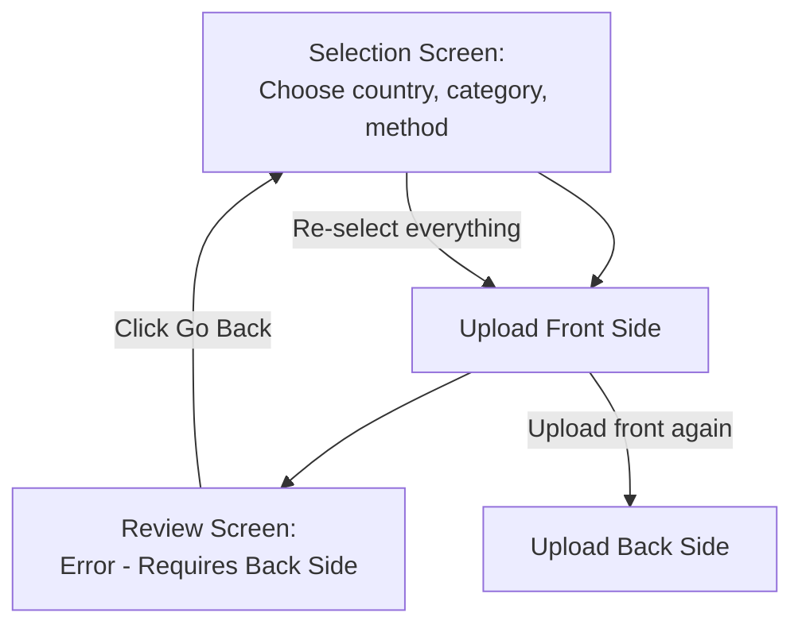
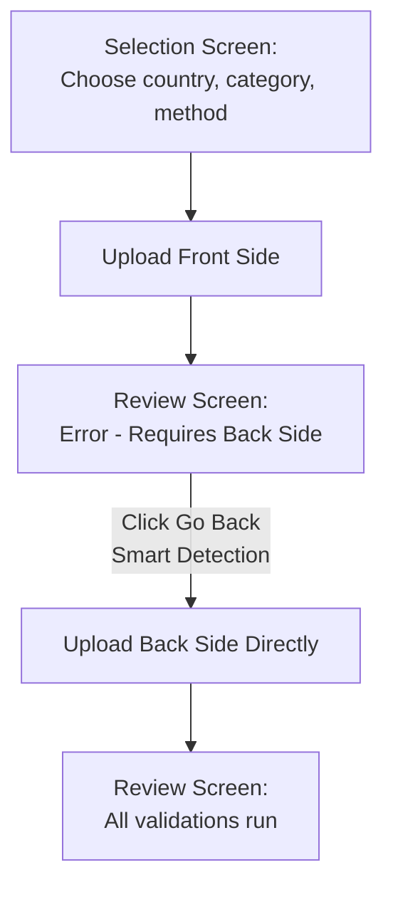

# Navigation Fix Summary - Document Back Side Upload

## Problem
When user uploads the front side and goes to review screen, if the back side is required but missing:
- Clicking "Go back" would send them to the **selection screen** (starting over)
- User would have to re-select country, category, document type, and upload method
- Poor UX - forces re-uploading the front side

## Solution
Smart navigation that detects document state and navigates directly to back side upload.

## Flow Diagram

### Before Fix


### After Fix


## Implementation Details

### 1. Smart Documents Component
**File**: `src/app/modules/auth/smart-enroll/smart-documents/smart-documents.component.ts`

**Change**: Auto-set `formSubmitted = true` if front is already uploaded

```typescript
// If front side is already uploaded, skip selection screen and go directly to upload component
const frontAlreadyUploaded = !!this.appRegistration?.documentValidation?.url;
if (frontAlreadyUploaded && this.enrollSettings.documentMethod) {
    this.formSubmitted = true;
}
```

**Logic**:
- `formSubmitted = false` → Shows selection screen
- `formSubmitted = true` → Shows upload/scanner component
- When front exists + documentMethod is set → Skip selection, show upload component

### 2. Smart Upload Component
**File**: `src/app/modules/auth/smart-enroll/smart-upload/smart-upload.component.ts`

**Change**: Auto-detect back side is needed and initialize with `side = "back"`

```typescript
// If front side is already uploaded and back is required but missing, start with back side
const docValidation = this.appRegistration?.documentValidation;
const frontExists = !!docValidation?.url;
const backRequired = this.promptTemplate?.requiresBackSide || docValidation?.requiresBackSide;
const backMissing = !docValidation?.backUrl;

if (frontExists && backRequired && backMissing) {
    this.side = "back";
}
```

**Logic**:
- Check if front URL exists
- Check if back is required
- Check if back URL is missing
- If all true → Initialize with `side = "back"`

### 3. Smart Scanner Component
**File**: `src/app/modules/auth/smart-enroll/smart-scanner/smart-scanner.component.ts`

**Change**: Same logic in `_resetVariables()` method

```typescript
// If front side is already uploaded and back is required but missing, start with back side
const docValidation = this.appRegistration?.documentValidation;
const frontExists = !!docValidation?.url;
const backRequired = this.requiresBack;
const backMissing = !docValidation?.backUrl;

if (frontExists && backRequired && backMissing) {
    this.side = "back";
} else {
    this.side = "front";
}
```

### 4. Document Review Component
**File**: `src/app/modules/auth/smart-enroll/smart-documents-review/smart-documents-review.component.ts`

**Change**: Smart navigation on "Go back"

```typescript
onPreviousStep(): void {
    // If document requires back side and back is not uploaded yet,
    // navigate back to document upload step instead of going to previous step
    const docValidation = this.appRegistration?.documentValidation;
    const requiresBackAndMissing = docValidation?.requiresBackSide && !docValidation?.backUrl;

    if (requiresBackAndMissing) {
        // Go back to document step to upload the back side
        this._smartEnrollService.skipToStep("document");
    } else {
        // Normal previous step navigation
        this._smartEnrollService.goToPreviousStep();
    }
}
```

## Complete User Flow

### Scenario: Document Requires Both Sides

1. **User on Selection Screen**
   - Selects: Upload method, Country (Panama), Category (ID Card), Document Type
   - Clicks Continue
   - `formSubmitted = true` → Shows upload component

2. **User Uploads Front**
   - Upload component shows with `side = "front"`
   - User uploads front side
   - Clicks Continue → Goes to review screen

3. **Review Screen Shows Error**
   - Error: "The document you have submitted requires both sides"
   - Continue button is DISABLED

4. **User Clicks "Go Back"** ⭐ This is the fix!
   - Document review detects: Front exists, back missing
   - Calls: `skipToStep("document")`
   - Smart-documents component initializes
   - Detects: Front uploaded + documentMethod set
   - Sets: `formSubmitted = true`
   - Shows: Upload component (NOT selection screen)
   - Upload component detects: Front exists, back needed
   - Initializes with: `side = "back"`
   - User sees: Upload screen ready for back side

5. **User Uploads Back**
   - Uploads back side
   - Clicks Continue → Goes to review screen

6. **Review Screen Runs Validations**
   - All validations run (name, background check, etc.)
   - Continue button enables when complete

## Benefits

✅ **No re-selection needed** - User doesn't have to re-select country, category, method
✅ **Preserves front side** - Front side upload is not lost
✅ **Direct to back upload** - Goes straight to uploading the back
✅ **Better UX** - Faster, more intuitive flow
✅ **Works with both upload and scan** - Logic applies to both methods

## Testing Checklist

- [ ] Upload front side via Upload method
- [ ] Go to review screen, see "requires back" error
- [ ] Click "Go back"
- [ ] Verify: Upload component appears (not selection screen)
- [ ] Verify: Shows "Upload back side" interface
- [ ] Upload back side
- [ ] Verify: Both sides are present
- [ ] Repeat test with Scan method
- [ ] Test with different document types (ID, Passport, License)

## Files Modified

1. `src/app/modules/auth/smart-enroll/smart-documents/smart-documents.component.ts`
2. `src/app/modules/auth/smart-enroll/smart-upload/smart-upload.component.ts`
3. `src/app/modules/auth/smart-enroll/smart-scanner/smart-scanner.component.ts`
4. `src/app/modules/auth/smart-enroll/smart-documents-review/smart-documents-review.component.ts`

---

**Fix Date**: February 7, 2026
**Status**: ✅ Complete
